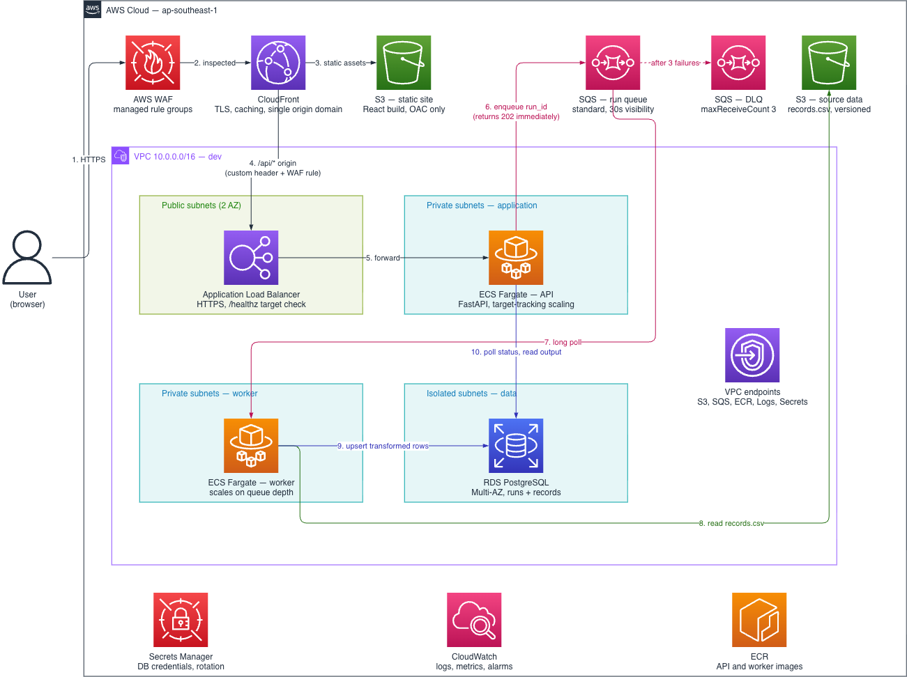

# Cloud-Native Data Transformation Pipeline

A full-stack application that lets a user trigger an asynchronous data transformation
pipeline and view its progress and output. This repository contains the AWS architecture
design, Terraform configuration, and a locally runnable implementation.

---

## Overview

The application has two workloads with very different characteristics: a **request path**
that must respond in milliseconds, and a **processing path** that runs for as long as the
data requires. The architecture exists to keep those apart.

The API accepts a trigger, records the intent, and hands off. A queue absorbs the handoff.
A worker performs the transformation on its own schedule. A relational database holds both
run state and transformed output, so the frontend can ask *"where is my run?"* and
*"what did it produce?"* through the same API without ever talking to the worker.

---

## Architecture



Editable source: [`docs/architecture.drawio`](docs/architecture.drawio) (diagrams.net, AWS
2019 icon set). Numbered edges on the diagram match the numbered steps below.

### Main components

| Component | Service | Responsibility |
|---|---|---|
| Edge | CloudFront + WAF | TLS, caching, one origin domain for SPA and API, filtering before traffic reaches the account |
| Static hosting | S3 (private, OAC) | Serves the React bundle; not publicly readable |
| Ingress | ALB, public subnets | Only internet-reachable component in the VPC |
| API | ECS Fargate, private subnets | Stateless FastAPI — accepts triggers, records run state, publishes to the queue, serves status and output |
| Queue | SQS standard + DLQ | Durable handoff; decouples request latency from processing time |
| Worker | ECS Fargate, private subnets | Consumes the queue, reads the source file, transforms, writes results |
| Source data | S3 (versioned) | Holds the input file; the worker reads it by key |
| Database | RDS PostgreSQL, isolated subnets | Single source of truth for run state and transformed records |
| Private connectivity | VPC endpoints (S3 gateway; SQS, ECR, Logs, Secrets interface) | Private subnets reach AWS services without a NAT gateway |
| Supporting | Secrets Manager, ECR, CloudWatch | Credentials, images, logs and alarms |

**Region:** `ap-southeast-1`. Nothing is region-specific except the CloudFront web ACL,
which AWS requires in `us-east-1`.

### Application and data flow

**Request path — synchronous, must be fast**

1. Browser requests the application over HTTPS. CloudFront is the only public entry point.
2. WAF inspects at the edge, before the request consumes compute in the account.
3. Static assets are served from S3 via Origin Access Control — the bucket has no public
   access policy.
4. `/api/*` is forwarded to the ALB as a second origin. One distribution for both origins
   means the SPA calls the API as a same-origin relative path: no CORS, one certificate.
5. The ALB forwards to Fargate API tasks in private subnets. The tasks have no public IP
   and accept traffic only from the ALB security group.
6. `POST /api/v1/runs` inserts a run row as `QUEUED`, publishes `{run_id, source_key}` to
   SQS, and returns `202 Accepted` with the run id. No transformation happens on the
   request thread — response time is one insert plus one publish, regardless of input size.

**Processing path — asynchronous**

7. The worker long-polls SQS and claims the run with a conditional update
   (`SET status='RUNNING' WHERE status='QUEUED'`), so a redelivered message cannot start a
   second execution.
8. It reads the source file from S3 by key.
9. It transforms, upserts the rows into PostgreSQL, and marks the run `SUCCEEDED` with its
   counters. On failure the message returns to the queue; after three receives it lands in
   the DLQ and the run is marked `FAILED`.
10. The frontend polls `GET /api/v1/runs/{run_id}`, then fetches
    `GET /api/v1/runs/{run_id}/records` once terminal.

The API and worker never talk directly. The database is the only state they share.

### The source data and the transformation

The sample file is not a flat dataset, and the design reflects that.

`records.csv` holds 50 rows of `id, record, timestamp`, where `record` is **base64-encoded
JSON**: `{object_id, action, type, diameter, geometry}`. Across those rows there are **10
distinct `object_id` values, each appearing five times** with increasing timestamps.
`action` is either `null` (upsert) or `"DELETE"` (tombstone). This is a **change-data-capture
changelog**, not a set of independent records.

The transformation replays the log rather than copying rows:

```
decode base64 → parse and validate JSON
  → order by (timestamp, id)
  → fold to latest state per object_id (last write wins)
  → drop objects whose final action is DELETE
  → derive segment_count, vertex_count, length_m, bbox from the WKT geometry
  → upsert keyed on (run_id, object_id)
```

Replaying the sample yields **10 objects: 1 deleted, 9 current.**

Two properties matter architecturally: it is a **pure fold over sorted events**, so it is
deterministic; and it is therefore **idempotent**, which is what makes at-least-once queue
delivery safe.

`length_m` is a Euclidean sum over the WKT vertices. Valid because the coordinates are in a
projected CRS in metres — the ranges (~30,000–49,000 E, ~20,000–39,000 N) are consistent
with SVY21. Geographic coordinates would need a geodesic calculation instead.

---

## Key design decisions

| Decision | Reasoning | Rejected alternative |
|---|---|---|
| Queue-based async | Survives instance replacement, gives retries, DLQ and visibility; API never holds data it isn't processing | In-process background task — dies with the instance, no retry, breaks with more than one API task |
| Message carries a key, not the payload | ~100 bytes; avoids the 256 KB SQS limit entirely and keeps the API free of data handling (its task role has no source-bucket read) | Embedding file contents, which forces the extended-client S3 offload anyway |
| SQS standard | Ordering is already in the payload — every event carries a timestamp and the transform sorts before folding | FIFO — caps throughput at 300 msg/s per group for information the data already contains |
| Idempotent worker | At-least-once delivery guarantees an eventual duplicate; conditional claim prevents double execution, upsert on `object_id` prevents duplicate rows | Assuming exactly-once, which SQS standard does not provide |
| One datastore | Run state and output can be joined in one query | DynamoDB for status — splits the data and forces application-side joins |
| PostgreSQL | Uniform relational output with filtering and pagination; leaves a path to PostGIS for spatial querying | Document store — no benefit for this shape |
| VPC endpoints, no NAT | S3 gateway endpoint is free; interface endpoints cost less than NAT at this scale and keep traffic off the public path | NAT gateway — ~USD 32/month plus per-GB processing |
| No RDS Proxy | Fargate tasks are long-lived and pool connections, so totals are bounded by `max_tasks × pool_size` at plan time | RDS Proxy solves Lambda-style connection storms, which this design does not have |
| One distribution, both origins | Removes CORS, one certificate, one place to attach WAF | Separate API subdomain — adds a preflight to every mutating request |

---

## Trade-offs

| Decision | Gained | Given up |
|---|---|---|
| Queue-based async | Durability, retries, independent scaling, DLQ visibility | Eventual consistency; at-least-once forces idempotency; more infrastructure |
| Fargate over Lambda | No 15-minute ceiling, no cold starts, connection pooling, local Compose mirrors production | Always-on cost, no scale-to-zero, images to build and store |
| Standard over FIFO | Higher throughput, simpler config | Ordering recovered from payload; duplicates handled in application logic |
| RDS over DynamoDB | Joins, familiar querying, PostGIS path | Instance to size and patch; connections are finite |
| Polling over push | Trivial, no persistent connections, works through any proxy | Wasted requests while idle; status latency bounded by poll interval |
| Public ALB behind CloudFront | Simple to provision | Needs a shared-secret header to prevent edge bypass |
| Single region | Simplicity, lower cost, data residency | No regional failover |

---

## Assumptions

1. **Scale:** tens of runs per day, input files in the order of megabytes. Instance sizing,
   task counts and poll intervals all follow from this.
2. **No authentication.** Production would add Cognito or OIDC and scope runs per user —
   an additive change to the current API.
3. **The source file is trusted** — a known, well-formed input in a controlled bucket.
   User uploads would need presigned URLs, size limits and content validation.
4. **Runs complete in seconds**, which justifies a 30-second visibility timeout and a
   2-second poll interval.
5. **Coordinates are projected, in metres.** Inferred from value ranges, not from an
   explicit CRS declaration in the data.
6. **Single environment.** Terraform represents development; staging and production reuse
   the same modules with different variables.

---

## Known limitations

Deliberate omissions with a stated reason, not oversights.

- **The ALB can be reached directly**, bypassing CloudFront and WAF. Mitigation: a shared
  secret header injected by CloudFront and enforced by a WAF rule on the ALB. The stronger
  fix is CloudFront VPC origins, making the ALB internal with no public listener.
- **Visibility timeout vs. processing time.** A transformation outliving the timeout is
  redelivered; the conditional claim prevents duplicate writes but wastes a worker. A
  `ChangeMessageVisibility` heartbeat would resolve it.
- **Polling does not scale** — request volume grows linearly with concurrent users. SSE or
  WebSockets are the production answer.
- **No backpressure on run creation.** An optional `idempotency_key` in the request body
  handles accidental double submission; real rate limiting needs the WAF rate-based rule,
  which the Terraform provisions on `POST /api/v1/runs`.
- **Single-AZ database in the dev Terraform.** Multi-AZ is on the diagram; see the Terraform
  section for the full simplification list.

---

## Local implementation mapping

The local implementation uses no cloud services but mirrors the same shape, so the two are
one design rather than two.

| Concern | Local | AWS |
|---|---|---|
| Static hosting | nginx (Compose) or the Vite dev server | CloudFront + S3 (OAC) |
| API | `uvicorn` container | ALB + ECS Fargate |
| Queue | `runs` table polled with a conditional claim | SQS standard + DLQ |
| Worker | Separate Compose service | ECS Fargate, scaled on queue depth |
| Database | SQLite (WAL mode) | RDS PostgreSQL, Multi-AZ |
| Source data | `./data/records.csv` bind mount | S3, via gateway endpoint |
| Configuration | Environment variables | SSM Parameter Store + Secrets Manager |

The local queue uses the same claim semantics SQS provides, expressed in SQL — moving to
SQS replaces one adapter, not the design.

Honest limitation: SQLite with two writing processes needs WAL mode and a busy timeout, and
will not survive meaningful write concurrency. Acceptable for a local demo; the first thing
that changes in a hosted environment.

---

## Potential improvements

1. **CloudFront VPC origins** — make the ALB internal and remove the bypass problem
   structurally.
2. **Server-sent events** for run status, replacing polling.
3. **Step Functions** if the pipeline grows past a single step — per-step retry and visible
   execution history, at the cost of moving logic out of application code.
4. **PostGIS** with a geometry column and spatial index, once anything queries the data
   spatially.
5. **Aurora Serverless v2** if load turns out spiky — higher unit cost for near-zero idle.
6. **Authentication and per-user run scoping.**

---

## Repository layout

```text
backend/       FastAPI API and the queue-consuming worker (one image, two entrypoints)
frontend/      React + TypeScript SPA
infra/         Terraform: 10 modules and one dev environment
data/          records.csv, the provided sample input
docs/          Architecture diagram
docker-compose.yaml
```

---

## Local setup and execution

Two supported ways to run it. Docker Compose is the closest to the deployed shape; the
manual path is better for development.

### Option A — Docker Compose (recommended)

Requires Docker Desktop or an equivalent daemon.

```bash
git clone <repository-url>
cd govtech-assessment
docker compose up --build
```

Then open **http://localhost:8080**.

| URL | What |
| --- | --- |
| http://localhost:8080 | The application |
| http://localhost:8000/docs | Interactive OpenAPI documentation |
| http://localhost:8080/healthz | Health probe |

`http://localhost:8000/` returns 404 by design — the API has no route at `/`. Port 8000 is
exposed only so the OpenAPI docs are reachable; the SPA talks to nginx on 8080.

```bash
docker compose down        # stop, keep the database
docker compose down -v     # stop and wipe the database
```

Three services come up: **web** (nginx serving the built SPA and proxying `/api`), **api**,
and **worker**. The database lives on a named volume and survives restarts.

### Option B — run the processes directly

Requires Python 3.11+ and Node 20+.

```bash
# Terminal 1 — API
cd backend
python3 -m venv .venv && source .venv/bin/activate
pip install -e ".[dev]"
uvicorn app.main:app --reload --port 8000

# Terminal 2 — worker
cd backend && source .venv/bin/activate
pipeline-worker

# Terminal 3 — frontend
cd frontend
npm install
npm run dev
```

Then open **http://localhost:5173**. The Vite dev server proxies `/api` to port 8000, so
the SPA is same-origin in development exactly as it is behind CloudFront in production.

No configuration is required — the defaults resolve to `backend/pipeline.db` and
`data/records.csv`. To override, export the variable or prefix the command:

```bash
PIPELINE_POLL_INTERVAL_SECONDS=0.1 pipeline-worker
```

> `backend/.env.example` documents every setting, but **nothing loads a `.env` file** —
> configuration is read from the environment. The file is a reference, not a config source.

| Variable | Default | Purpose |
| --- | --- | --- |
| `PIPELINE_DATABASE_PATH` | `./pipeline.db` | SQLite file, shared by API and worker |
| `PIPELINE_SOURCE_FILE` | `../data/records.csv` | Input file (stands in for an S3 object) |
| `PIPELINE_VISIBILITY_TIMEOUT_SECONDS` | `30` | How long a claimed run stays invisible |
| `PIPELINE_MAX_ATTEMPTS` | `3` | Attempts before a run is terminal (the DLQ equivalent) |
| `PIPELINE_POLL_INTERVAL_SECONDS` | `1.0` | Worker poll interval |
| `PIPELINE_CORS_ORIGINS` | `http://localhost:5173` | Only needed for the Vite dev server |

### Tests

```bash
cd backend  && source .venv/bin/activate && pytest     # 24 tests
cd frontend && npm run test                            # 29 tests
cd frontend && npm run lint && npm run typecheck
cd infra    && ./validate.sh                           # fmt, validate, tflint, trivy
```

---

## API

Base path `/api/v1`. Full interactive documentation is served at `/docs`, generated from
the same Pydantic models the endpoints validate against.

| Method | Path | Purpose |
| --- | --- | --- |
| `GET` | `/healthz` | Liveness probe; the path the ALB target group polls |
| `POST` | `/api/v1/runs` | Trigger a run. Returns **202** immediately |
| `GET` | `/api/v1/runs` | Run history, paginated |
| `GET` | `/api/v1/runs/{run_id}` | Run status — what the frontend polls |
| `GET` | `/api/v1/runs/{run_id}/records` | Transformed output, paginated |

### `POST /api/v1/runs`

Inserts a run row, returns, and does no pipeline work. Response time is one insert
regardless of input size.

```jsonc
// Request body (all fields optional)
{ "idempotency_key": "optional-client-supplied-string" }
```

```jsonc
// 202 Accepted, with Location: /api/v1/runs/{run_id}
{
  "run_id": "d21b6316-e2b1-43fd-a88f-4e781237b5b6",
  "status": "QUEUED",
  "source_key": "records.csv",
  "attempts": 0,
  "created_at": "2026-09-20T18:39:16.106575+00:00",
  "started_at": null, "finished_at": null, "error": null,
  "events_read": null, "objects_written": null, "objects_deleted": null
}
```

Repeating a request with the same `idempotency_key` returns the original run rather than
queueing a second one.

### `GET /api/v1/runs/{run_id}`

`status` is one of `QUEUED`, `RUNNING`, `SUCCEEDED`, `FAILED`. The counters are null until
the run succeeds; `error` is populated only on failure.

```jsonc
{
  "run_id": "d21b6316-…", "status": "SUCCEEDED", "attempts": 1,
  "events_read": 50, "objects_written": 9, "objects_deleted": 1,
  "started_at": "…", "finished_at": "…", "error": null
}
```

### `GET /api/v1/runs/{run_id}/records`

`?limit=` (1–500, default 50) and `?offset=`.

Returns **200 with an empty list** while a run is still in flight — the run exists, its
output does not yet — so the caller checks `status`, not the HTTP code. A genuinely unknown
`run_id` is a 404.

```jsonc
{
  "run_id": "d21b6316-…",
  "status": "SUCCEEDED",
  "records": [
    {
      "object_id": "550e8400-e29b-41d4-a716-446655440001",
      "type": "E", "diameter": 988.2,
      "geometry": "LINESTRING (46620 36940, 47780 37720)",
      "segment_count": 1, "vertex_count": 2, "length_m": 1397.856,
      "bbox": { "min_x": 46620, "min_y": 36940, "max_x": 47780, "max_y": 37720 },
      "last_event_id": 40, "last_event_at": "2026-08-12 17:35:06.407894"
    }
  ],
  "page": { "total": 9, "limit": 50, "offset": 0 }
}
```

### Errors

`{"detail": "..."}` for handled errors — 404 for an unknown run, 422 for a parameter
outside its bounds.

---

## Terraform

`infra/` holds ten modules and one environment. **It has never been applied** — there is no
state file, no AWS account behind it, and no cost has been incurred. It is written to be
read and statically checked.

```bash
cd infra
./validate.sh          # fmt, validate, tflint, trivy
```

Everything runs with `terraform init -backend=false`, which initialises modules and
providers only — so no credentials are needed and nothing can reach AWS.

```text
infra/
  modules/
    network/         VPC, 3 subnet tiers × 2 AZs, route tables, VPC endpoints
    security/        Security groups, IAM roles and policies
    s3_site/         Static site bucket + CloudFront + WAF web ACL
    s3_source/       Versioned bucket holding the pipeline input
    alb/             Load balancer, target group, listener
    ecs_service/     Generic Fargate service — instantiated twice
    sqs/             Run queue + DLQ + redrive policy
    rds/             Subnet group, parameter group, instance, credentials secret
    ecr/             Image repositories with lifecycle policies
    observability/   Log groups, alarms, SNS topic
  envs/dev/          The only environment: wiring, variables, outputs
```

84 resources across 42 AWS types. Each module has its own README with design notes and a
generated inputs/outputs table; **[`infra/README.md`](infra/README.md) carries the full
simplification list** and the reasoning behind the module split.

A few properties worth calling out:

- **`ecs_service` is genuinely generic.** The API and worker are two calls to one module.
  Passing `target_group_arn` makes a service load-balanced; the worker passes none of the
  load-balancer inputs and gets a queue consumer. There are no near-identical modules.
- **No hardcoded account IDs, ARNs, AZ names or CIDRs.** All derived from
  `aws_caller_identity`, `aws_partition`, `aws_region`, `aws_availability_zones` and
  `cidrsubnet()`.
- **No secrets anywhere.** The database password is generated by `random_password`, written
  straight to Secrets Manager, and is never an input, a tfvars value, or an output.
- **Least privilege between services.** The API can publish to the queue and read the DB
  secret; it has **no S3 permission at all**, because the queue message carries a key rather
  than the payload. Task roles are separate from execution roles.
- **`for_each` throughout, `count` nowhere.** Every collection is keyed by name, so removing
  one element does not renumber the others in state.
- **State locking uses `use_lockfile`**, not the deprecated `dynamodb_table`.

Three things on the architecture diagram are deliberately **not** in the dev environment:
Multi-AZ on the database, ECS autoscaling, and the shared-secret header that would stop the
ALB being reached directly. All are documented with reasoning in `infra/README.md`.

---

## Key technical decisions — implementation

The architecture decisions are in the table above. These are the ones made while building
the local implementation.

| Decision | Reasoning | Rejected alternative |
| --- | --- | --- |
| **Separate worker process**, not a background task | Survives an API restart, retries, and scales independently of request traffic | `BackgroundTasks` — dies with the process, no retry, and breaks with more than one API replica |
| **The `runs` table is the queue** | Expressing SQS's claim semantics in SQL means moving to SQS replaces one adapter, not the design | A second local broker (Redis, RabbitMQ) — more moving parts for a demo, and less like the target |
| **No ORM** — stdlib `sqlite3` with hand-written SQL | The claim is `UPDATE … WHERE id = (SELECT … LIMIT 1) RETURNING *`; an ORM would need raw SQL for it anyway. Two tables do not justify the dependency | SQLAlchemy — the right call against the Postgres in the Terraform, for pooling and migrations |
| **Pydantic at the API boundary only** | Typed request/response models and generated OpenAPI, without coupling the schema to the database | Sharing one model between DB and API, which couples storage shape to the public contract |
| **`records` keyed `(run_id, object_id)`** | Keeps each run's output viewable *and* makes redelivery idempotent | Keying on `object_id` alone — a single current-state table, but then each run overwrites the last |
| **Polling for status**, 1s interval | Trivial, no persistent connection, works through any proxy | SSE/WebSockets — the production answer, unnecessary at this scale |
| **Vite dev proxy / nginx `/api` proxy** | The SPA is same-origin with the API locally *and* in production, so there is no CORS and no per-environment base URL | A configurable API base URL plus CORS — more config and a preflight on every mutating request |
| **Hand-written API types in the frontend** | Nine types; a generator would be more machinery than it saves | Generating from `/openapi.json` — the right move once the surface grows |

---

## AI tool usage

**Tool:** Claude (Anthropic), used as a coding assistant through Claude Code.

**What it was used for:** scaffolding the Terraform modules and the React component
structure, drafting first passes of the transformation logic and test suites, and as a
reviewer for the architecture write-up. Every design decision below was reviewed, and in
several cases overridden, before being kept.

**A suggestion accepted.** Expressing the local queue as a conditional `UPDATE … RETURNING`
on the `runs` table, rather than an in-memory list or a separate broker. The argument was
that it reproduces SQS's actual semantics — visibility timeout, at-least-once delivery, a
redelivery path after a crashed worker — so the local implementation demonstrates the real
concurrency behaviour instead of hiding it. That turned out to be right, and it is why the
worker is idempotent by construction rather than by assertion.

**A suggestion substantially changed.** The first design keyed the output table on
`object_id` alone, matching the "upsert keyed on object_id" phrasing in the architecture
notes. That is correct for a current-state table but wrong for this application: each run
would overwrite the previous run's output, so "view the output of run X" would break for
every run but the most recent. Changed to a composite key of `(run_id, object_id)`, which
keeps per-run history *and* preserves idempotency under redelivery. A second change: the
suggested ALB security group allowed `0.0.0.0/0` on 443; that was narrowed to CloudFront's
`origin-facing` managed prefix list, which is stricter and consistent with having no ACM
certificate in this environment.

**How the implementation was verified.** Nothing was accepted because it looked plausible:

- **Against the real data.** The transformation's expected output — 50 events, 10 objects,
  1 deleted, 9 current — was derived by independently replaying `records.csv`, not taken
  from the generated code. `length_m` was checked by hand: `LINESTRING (46620 36940,
  47780 37720)` → √(1160² + 780²) = 1397.856, matching the API.
- **Tests that fail without the fix.** For both regression tests, the bug was reintroduced
  to confirm the test actually caught it rather than passing incidentally.
- **End-to-end through the running stack**, not just unit tests: triggering a run through
  nginx and confirming the 202 returns in ~27 ms while the worker does the work afterwards.
- **Concurrency.** Sequential `curl` checks passed while a genuine bug remained: FastAPI can
  run a sync dependency's setup and teardown on different threadpool threads, which SQLite
  rejects by default. It only appeared when the browser issued parallel requests. Fixed with
  `check_same_thread=False` — safe because each request owns its connection — and pinned by a
  test issuing 18 concurrent requests.
- **Static analysis as a gate**, not decoration: `terraform validate` and `tflint` report
  zero findings, `trivy`'s 16 findings (13 distinct rules) are each accepted with a written
  reason in `.trivyignore`, and the frontend passes ESLint's `strictTypeChecked` rules with
  no `any` and no suppression comments.

The residual risk is honest: this has never run against real AWS, so the Terraform is
verified only to the depth static analysis reaches.

---

## Known gaps in this submission

- **The Terraform has never been applied.** Static validation catches syntax, typing and
  dependency errors; it does not catch an IAM policy that is subtly too narrow or a
  security group rule that blocks real traffic.
- **No authentication.** Any caller can trigger a run and read every run's output.
- **SQLite is the local queue *and* the local database.** Two processes writing one file is
  the weakest part of the local setup, and the first thing that changes when hosted.
- **No CI pipeline.** Tests, linting and the Terraform checks are run manually.
